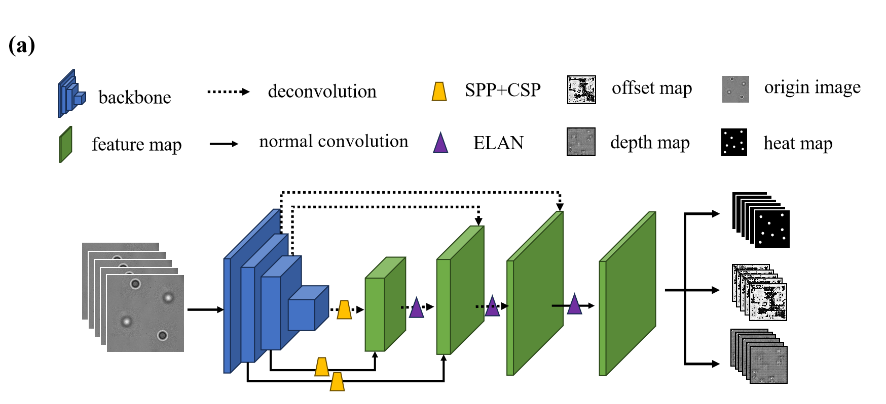
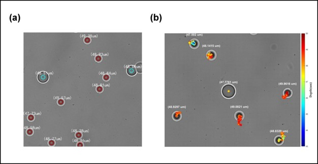

# Real-time 3D Tracking of Multi-Particle in the Wide-field Illumination Based on Deep Learning
### This code belongs to the paper Deep Learning Based Real-Time 3D Tracking of Multiparticles under Wide Area Illumination  

## Environmental dependencies
### Please read requirements.txt

## Code running steps
### 1. Extract image data and target data from customized datasets.
  #### First, you need to run the codes inside the database folder. You can only train or test the network with the train.txt and the val.txt.The code we provide supports datasets in VOC format.
### 2. Training and Testing the network  
  #### You can run the train.py directly to train the network.  
  ##### You can run the eval.py directly to test network performance.
  ##### You can run the predict.py directly to see the inference results for a single image.  

## Result
  #### The localization capabilities of the network are shown below:

## More details
  #### 1. Three backbones are available in the networks file within the model directory, with RESNETX proving to be the most effective, which is also proposed in the paper.
  #### 2. Our code is just a demo; many things still need to be improved; we will enhance the network later.
  #### 3. The code works both in Windows and Linux environments 
  #### 4. Some parameters need to be set in config.txt.
  #### 5. The training model and dataset are available in this link: https://drive.google.com/drive/folders/1_9adDfYCc0HfKadxI1GbkmTfuz58J0ca