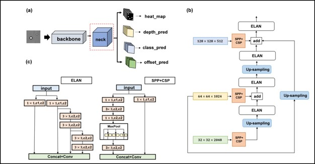
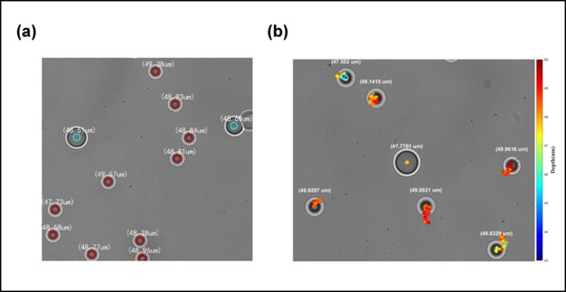
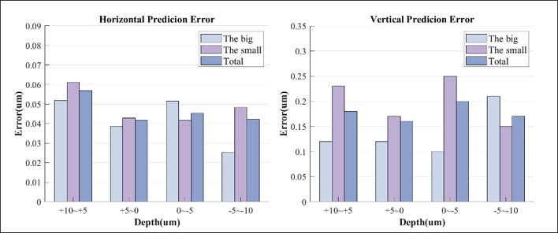

# Real-time 3D Tracking of Multi-Particle in the Wide-field Illumination Based on Deep Learning
This code belongs to the paper Deep Learning Based Real-Time 3D Tracking of Multiparticles under Wide Area Illumination  

## Environmental dependencies
Please read requirements.txt

## Catalog Structure Description
├── database   
&nbsp;&nbsp;&nbsp;&nbsp;&nbsp;&nbsp;&nbsp;|——dataloader  &nbsp;&nbsp;&nbsp;&nbsp;&nbsp;&nbsp;&nbsp;&nbsp;&nbsp;&nbsp;&nbsp;&nbsp;&nbsp;&nbsp;&nbsp;&nbsp;&nbsp;( Extract image data and target frame data from customized datasets )  
&nbsp;&nbsp;&nbsp;&nbsp;&nbsp;&nbsp;&nbsp;|——mean_std    &nbsp;&nbsp;&nbsp;&nbsp;&nbsp;&nbsp;&nbsp;&nbsp;&nbsp;&nbsp;&nbsp;&nbsp;&nbsp;&nbsp;&nbsp;&nbsp;&nbsp;&nbsp;&nbsp;( Calculate the variance and mean of the data set )  
&nbsp;&nbsp;&nbsp;&nbsp;&nbsp;&nbsp;&nbsp;|——split_train_val&nbsp;&nbsp;&nbsp;&nbsp;&nbsp;&nbsp;&nbsp;&nbsp;&nbsp;&nbsp;&nbsp;&nbsp;&nbsp;&nbsp;&nbsp;&nbsp;&nbsp;( Split the dataset proportionally into a training set and a validation set )  
├── logs                  
&nbsp;&nbsp;&nbsp;&nbsp;&nbsp;&nbsp;&nbsp;|——dla  
&nbsp;&nbsp;&nbsp;&nbsp;&nbsp;&nbsp;&nbsp;|——resnet50  
&nbsp;&nbsp;&nbsp;&nbsp;&nbsp;&nbsp;&nbsp;|——resnet50x  
&nbsp;&nbsp;&nbsp;&nbsp;&nbsp;&nbsp;&nbsp;|——resnet101  
├── models   
&nbsp;&nbsp;&nbsp;&nbsp;&nbsp;&nbsp;&nbsp;|——networks   
&nbsp;&nbsp;&nbsp;&nbsp;&nbsp;&nbsp;&nbsp;|——centernet_training   
&nbsp;&nbsp;&nbsp;&nbsp;&nbsp;&nbsp;&nbsp;|——model  
├── utils1  
&nbsp;&nbsp;&nbsp;&nbsp;&nbsp;&nbsp;&nbsp;|——utils  
&nbsp;&nbsp;&nbsp;&nbsp;&nbsp;&nbsp;&nbsp;|——utils_bbox  
&nbsp;&nbsp;&nbsp;&nbsp;&nbsp;&nbsp;&nbsp;|——utils_fit  
├── CenterNet_test                       
├── eval  &nbsp;&nbsp;&nbsp;&nbsp;&nbsp;&nbsp;&nbsp;&nbsp;&nbsp;&nbsp;&nbsp;&nbsp;&nbsp;&nbsp;&nbsp;&nbsp;&nbsp;( Evaluate network performance on a test set )   
├── predict  &nbsp;&nbsp;&nbsp;&nbsp;&nbsp;&nbsp;&nbsp;&nbsp;&nbsp;&nbsp;&nbsp;&nbsp;&nbsp;&nbsp;( Showing the results of the network's prediction of an image )  
├── requeriements   
├── train   &nbsp;&nbsp; &nbsp;&nbsp;&nbsp;&nbsp;&nbsp;&nbsp;&nbsp;&nbsp;&nbsp;&nbsp;&nbsp;&nbsp;&nbsp;&nbsp;&nbsp;&nbsp;&nbsp;( Training the network )  

## Result  

## Code running steps
### 1. If you are not using the data provided in peper  
  First of all, you need to run the codes inside the database folder. You can only train or test the network when you have the train.txt and the val.txt.
### 2. If you are using the data provided in peper  
  You can run the train.py directly to train the network.  
  You can run the eval.py directly to test network performance.  
  You can run the predict.py directly to see the inference results for a single image.  
### 3. Test this network
  You can use the eval.py to test the performance of the network on the test set.  

## More details
1. Four backbones are available in the networks file within the model directory, with the ResNetx proving to be the most effective which is also proposed in the paper.  

2. Our code is just a demo, there are still a lot of things that need to be improved, for example, we don't use the argparse module to get the input parameters. We will improve the network later.
3. What is stored inside the logs file is the trained model and the changes in parameters such as loss during training.
4. The code works both in windows and Linux environments!  

